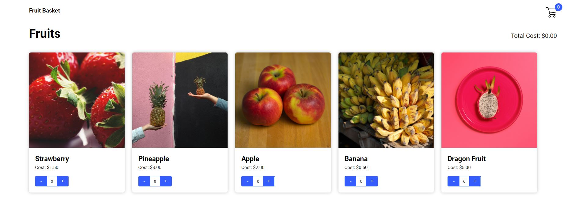
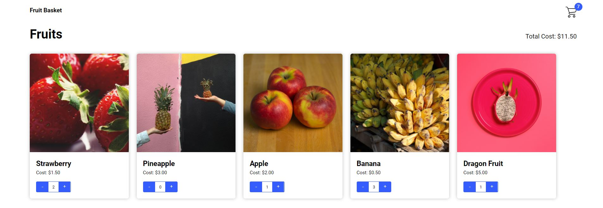

There are various ways to manage state in React. The `useState` hook is used to manage component level state. React also provides `context` API to share values/state between components without having to explicitly pass a prop through every level of the tree. Then there is Redux, which is widely use to manage the global state of the app. If you've used Redux, you know that there's lot of boilerplate code required just to get redux started. Although there are other libraries that can be used to manage the global state of React apps that don't have such boilerplate to set up, Redux is still widely used.

One of such library is [Zustand](https://github.com/pmndrs/zustand). Zustand is a small, un-opinionated library for state management in React (also can be used without React). It doesn't have boilerplate to set up and uses hooks as primary means of consuming state. It just have state and functions to update the state. As easy as it sounds. It is pretty new and will take time to get going. Everyone may not use it in their production apps but we can build something just to try it out.

## Demo Project

### Setup

I created a small project with React to try out Zustand. The project is pretty simple. It consists of list of fruits with their cost. We can add a fruit to the cart by incrementing the count.



When we increment the count of any fruit, the count in the cart in Navbar also increases. Below the navbar there's a header which keeps track of the total cost of the cart. The data is just hard-coded in an object.

```ts
// fruits.ts

export const fruits = [
	{
		id: 1,
		name: 'Strawberry',
		img:
			'https://images.pexels.com/photos/1788912/pexels-photo-1788912.jpeg?cs=srgb&dl=pexels-suzy-hazelwood-1788912.jpg&fm=jpg',
		cost: 1.5
	},
	{
		id: 2,
		name: 'Pineapple',
		img:
			'https://images.pexels.com/photos/4412925/pexels-photo-4412925.jpeg?cs=srgb&dl=pexels-maksim-goncharenok-4412925.jpg&fm=jpg',
		cost: 3
	},
	{
		id: 3,
		name: 'Apple',
		img:
			'https://images.pexels.com/photos/3746517/pexels-photo-3746517.jpeg?cs=srgb&dl=pexels-andie-3746517.jpg&fm=jpg',
		cost: 2
	},
	{
		id: 4,
		name: 'Banana',
		img:
			'https://images.pexels.com/photos/47305/bananas-banana-shrub-fruits-yellow-47305.jpeg?cs=srgb&dl=pexels-pixabay-47305.jpg&fm=jpg',
		cost: 0.5
	},
	{
		id: 5,
		name: 'Dragon Fruit',
		img:
			'https://images.pexels.com/photos/2907428/pexels-photo-2907428.jpeg?cs=srgb&dl=pexels-aleksandar-pasaric-2907428.jpg&fm=jpg',
		cost: 5
	}
];
```

### Creating the store

To create a store in Zustand, we use the `create` function provided as default export from it. The `create` returns a hook that has our data and functions to manipulate them. Let's name our hook as `useFruits`.

```ts
// store.ts

import create from 'zustand';

export const useFruits = create();
```

Now what do we put in our store. We'll have a `cart` array that holds what fruit is been added to the cart and how many of them. To update the cart, there will be two functions `addToCart` and `removeFromCart`. The `create` function takes a function as an argument where it passes a `set` function to update the values of state. Let's see how it works.

```ts{5-9}
// store.ts

import create from 'zustand';

export const useFruits = create(set => ({
	cart: [],
	addToCart: () => {},
	removeFromCart: () => {}
}));
```

The default state of our store will be `cart = []`. Now lets add functionality to add a fruit to the cart. To add a fruit to the cart we'll need the `id` of the fruit. We then call the `set` function to add that fruit to the cart. Before that we do some checks to ensure a fruit is not added multiple times but its count in the cart is increased. Using the `find` function we see if that fruit is already in the cart. If no, then we append that fruit to the `cart` array. If the fruit is already in the cart, we just increase the count of that fruit. Lastly, we return the updated state.

```ts{7-26}
// store.ts

import create from 'zustand';

export const useFruits = create(set => ({
	cart: [],
	addToCart: id =>
		set(state => {
			const isPresent = state.cart.find(fruit => fruit.id === id);

			if (!isPresent) {
				return {
					...state,
					cart: [...state.cart, { id, count: 1 }]
				};
			}

			const updatedCart = state.cart.map(fruit =>
				fruit.id === id ? { ...fruit, count: fruit.count + 1 } : fruit
			);

			return {
				...state,
				cart: updatedCart
			};
		}),
	removeFromCart: () => {}
}));
```

We can see that the `set` function has our `state` in it. We then perform our checks and return the updated state. The thing to note here is we return the updated state rather than mutating it, just like we do in Redux. The `removeFromCart` is also easy to implement. We check if the fruit is in the cart, if not, we just return the current state as non-existing fruit must not be removed. We then update the cart by decrementing the count of the fruit. But, we may also get negative count, so we use `Math.max(currentCount, 0)` to restrict the minimum count to zero and avoid bugs. Another issue is even if count of a fruit in the cart is 0, the fruit is still in the array. We don't want that, the fruit should be removed if the count is 0. So, we filter through the array and remove the fruits with count 0.

```ts{27-45}
// store.ts

import create from 'zustand';

export const useFruits = create(set => ({
	cart: [],
	addToCart: id =>
		set(state => {
			const isPresent = state.cart.find(fruit => fruit.id === id);

			if (!isPresent) {
				return {
					...state,
					cart: [...state.cart, { id, count: 1 }]
				};
			}

			const updatedCart = state.cart.map(fruit =>
				fruit.id === id ? { ...fruit, count: fruit.count + 1 } : fruit
			);

			return {
				...state,
				cart: updatedCart
			};
		}),
	removeFromCart: id =>
		set(state => {
			const isPresent = state.cart.findIndex(fruit => fruit.id === id);

			if (isPresent === -1) {
				return {
					...state
				};
			}

			const updatedCart = state.cart
				.map(fruit => (fruit.id === id ? { ...fruit, count: Math.max(fruit.count - 1, 0) } : fruit))
				.filter(fruit => fruit.count);

			return {
				...state,
				cart: updatedCart
			};
		})
}));
```

And thats it. We have all the functionality that we need.

### Using Zustand with React

We've created the store and ready to connect it with React. To do so we just import the `useFruits` hook that we've created in using the `create` function. That's it. No wrapping of Providers, no connecting with Higher-order functions. We can fetch everything by just calling `useFruits()` hook, or slices of the state by passing a selector.

```ts
const cart = useFruits(state => state.cart);
const addToCart = useFruits(state => state.addToCart);
const removeFromCart = useFruits(state => state.removeFromCart);
```

The count of a particular fruit in the cart is determined using the `cart` from the store. That count is been displayed in the card. We get the fruit count from the cart and or use 0 as default.

```ts
const fruitsInCart = cart.find(f => f.id === id)?.count || 0;
```

The `addToCart` and `removeFromCart` functions are used as onClick handlers on the buttons where we pass the fruit id to them.

In the Navbar, we display total count of the fruits added to the cart. Meaning, if we add Apple 2 times, it will show 2 in the cart. For that we just add the count of all fruits in the cart using the `reduce` function.

```ts
const totalFruits = cart.reduce((prev, current) => prev + current.count, 0);
```

Now, in the header, we show the total cost of the cart. We can get the cost of each fruit using our static data and multiply it with the total items in the cart for the fruit. We then just sum them to get the total cost of the cart.

```ts
const totalCost = cart.reduce((prev, current) => {
	const fruit = fruits.find(f => f.id === current.id);

	const fruitCost = fruit!.cost * current.count;

	return prev + fruitCost;
}, 0);
```

We can use these variables in our React app to display the count. And that's it. If we add a fruit or remove it from the cart, the cart count, count in the fruit card and the total cost will be updated and they all will be in sync.



Here, I've added 2 Strawberries, 1 Apple, 3 Bananas and 1 Dragon Fruit to the cart which adds up to 7 items that is been displayed in the navbar. Also, the total cost is the sum of cost of all fruits.

## Conclusion

Zustand was very easy to understand and use. It does not have a big boilerplate setup and was ready to use just by creating a store. It uses hooks, meaning there will be less code to write. We can also use [async](https://github.com/pmndrs/zustand#async-actions) code in it and update the state after the async code is finished using the `set` function. There are many more things we can do with Zustand that we can go through in the [GitHub Repo](https://github.com/pmndrs/zustand). Overall, it was a fun experience using Zustand and you should give it a try too!
