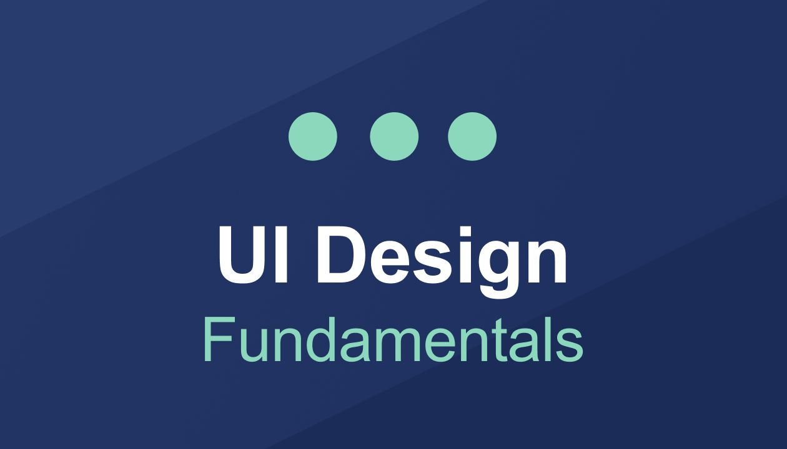
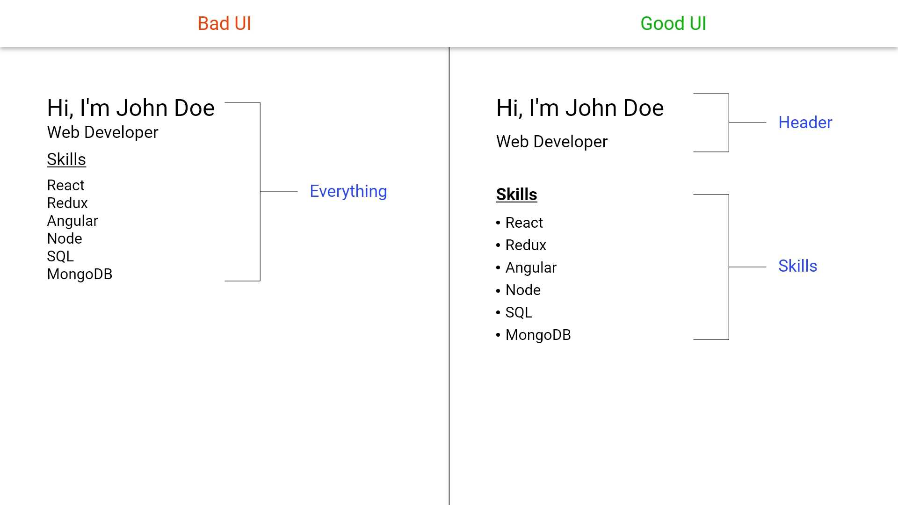
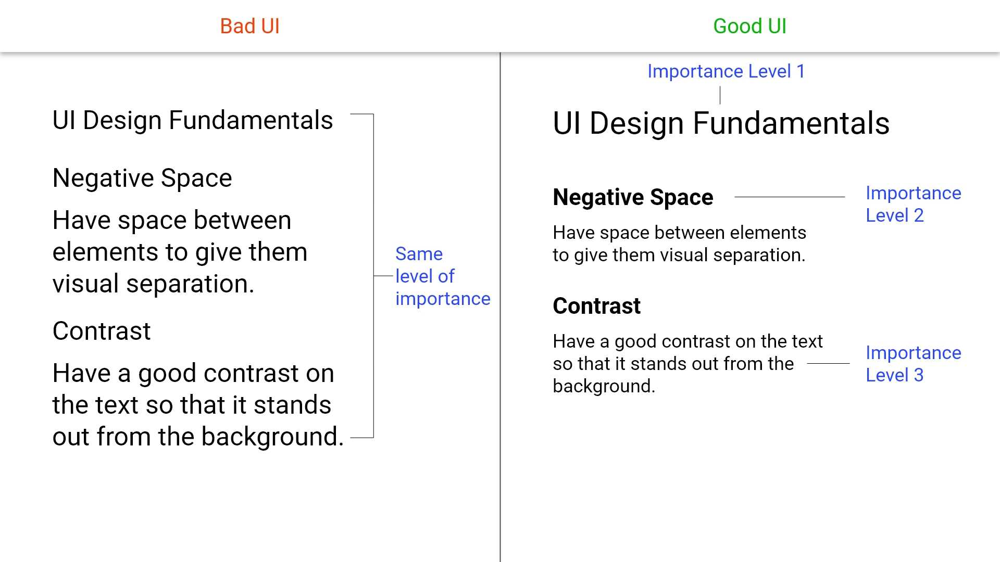
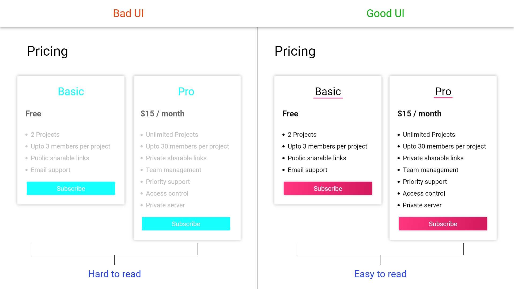
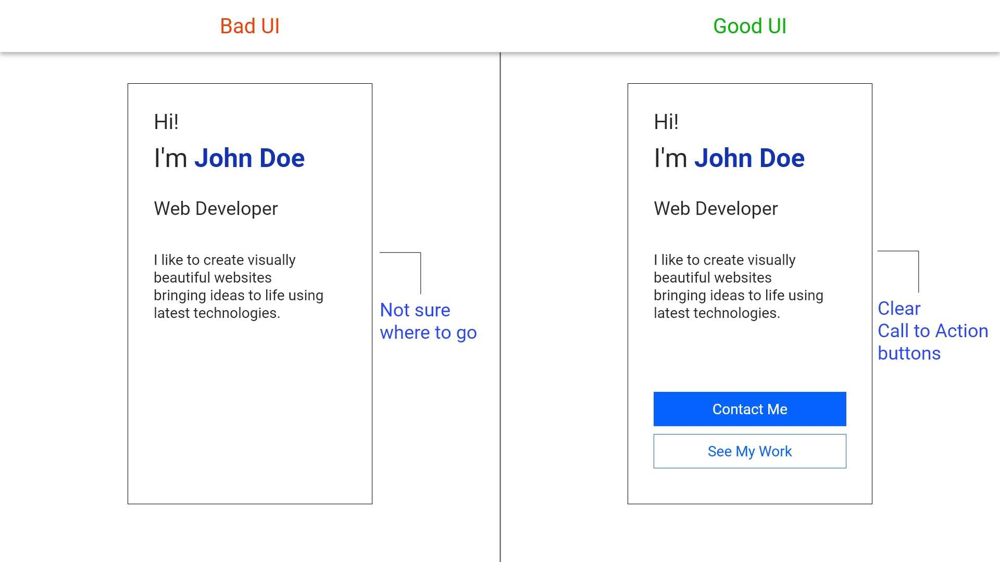
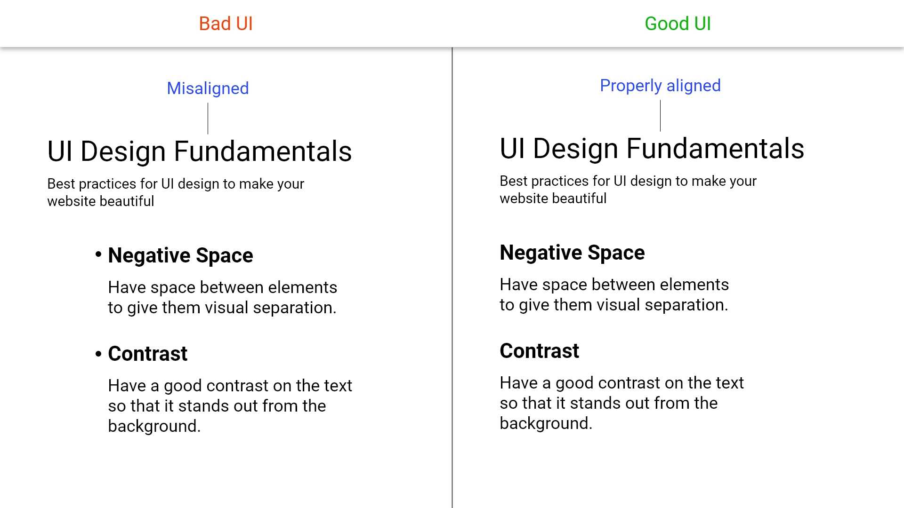
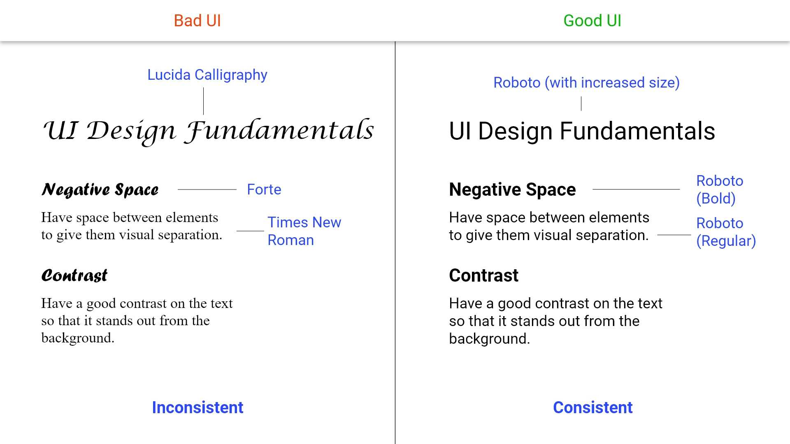
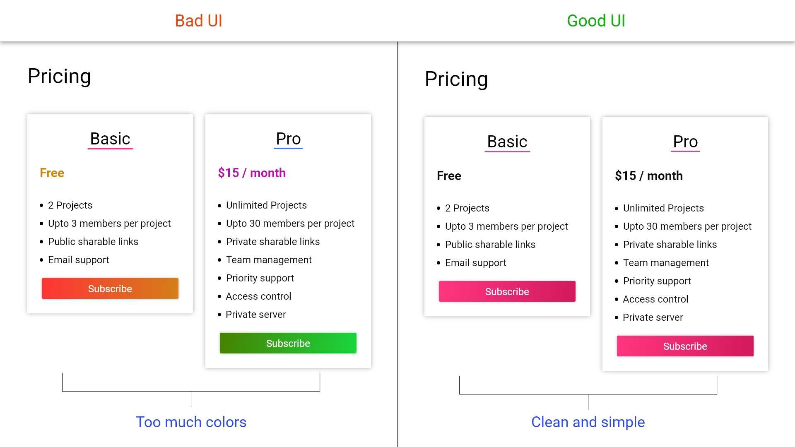

With the ever increasing popularity of UI frameworks and libraries, developers are focusing to make their website **work** better. But in the process, they forget to make their website **look** better. Developers can create a website that has well structured and optimized code, but the User Interface is as bad as their grades in Linear Algebra. Most of the people will not look at the code (unless they're hiring you) and will judge your website on basis of the UI.

Mostly beginners and sometimes even intermediate developers face the problem of having a bad interface. Learning UI design fundamentals may not be as important for someone who has just started web development. But, this is a skill that I think every front-end developer should develop gradually, at least the basics.

Many of the articles that I had read in the past regarding UI design contain few points that are related to UX (User Experience), which is a huge field to study in itself. Although UI and UX go hand-in-hand with each other, in this article I'm going to focus mostly on the UI with a little exposure to UX to get you going. I'm not a UI/UX guy. These are the things I learned as I was learning Front-end development.

## Give room to breathe

This is one of the most common and basic mistake that people make while coding their UI, lack of what designers call **White Space** or **Negative Space**. They clutter so much things together that it makes it difficult to read or understand. Specially on desktop, where there is a lot of space to place the elements. Make use of the empty space and spread out the UI, give everything a clearly defined area so that there is a visible separation among the elements.

## Have a visual hierarchy

Almost every element on the UI has some level of importance in the layout. Give a visual indication of that by increasing font size and/or making it bold making it stand out than others. Colors can also be used to indicate the importance but should be used carefully as it may make the UI even worse.

## Let them see

There are situations when people are unable to read because the text does not have enough [Color Contrast](https://www.boia.org/blog/the-basics-and-importance-of-color-contrast-for-web-accessibility) or the text is too small. Light text on light background or the vice-versa may look cool but it makes it difficult to read, and for the people with vision problems it becomes impossible to use the website. Have a good contrast on the text so that it stands out from the background and have a readable font size.

## Give directions

This is more of a UX thing but important enough to highlight. When a user visits your website, give them a clear indication of what they can do to next. Having a **Call to action** button is a great way of achieving it. If you have a personal website, having a button that takes the user to contact page will give them a clear indication of where they'll be going rather than having nothing but your name and job title on the front page and let user try to find out where to go.

## Align yourself

Even a misalignment of single pixel can throw off the overall feel of UI. Users get annoyed by a subtle change in UI. This can be the easiest thing to catch as it just don't seem right to look at the UI. Have a starting and ending point for the layout and sub-layouts. Center the text in the buttons both horizontally and vertically. In short, just align the elements.

## Be consistent

Users will not memorize layout of every page of your website. Having different layout everywhere just so that it matches the content on that page can cause inconsistencies. Users will find it difficult to browse through the page as they are viewing a whole different thing than what they just saw a second ago. Have a similar layout thoughout the website.

Choosing a font may be difficult as you may find various fonts that are a good fit for your website. Using everyone of them will make the flow of the UI inconsistent. Use a single font with various weights to give the visual hierarchy you need. A second font can be used just to highlight important stuff or as heading font, but usage of more than two fonts will be too much.

Also while using icons, have a single source for them. Having different sources for different icons will cause difference in padding, height and width which will result in different sizes on same element. Best thing is to design your own icons.

## Have less text, but more information

This again goes into UX field. Users usually just read the heading of a section and if they find that interesting they'll read the rest. Rather than writing an essay on every feature of your product, write a sentence that best describes the feature with a brief explanation of a line or two below it. Having an image, illustration or a video next to it will give the user better experience.

## Don't use rainbows

Use less colors. As boring as it may sound, it will make the website a lot better. Having less set of colors will give the users the feel of been on same website. Users will know what a specific color correspond to on the website and will have no trouble browsing the pages. Having a Primary and Secondary colors with their light and dark shades along with black and white are good enough to make the UI delightful.

## Keep It Simple Stupid

Developers get excited when they learn a new thing and want to try it everywhere. Well, CSS animations is one of them. Adding too many animations to the UI will distract the user from what they are actually trying to do. Use animations only when you are giving feedback to the user, like when button is clicked push it down or when something is loading. Don't spin every element 360° when it is hovered.

Use a simple and minimal UI with proper layout unless you are actually building something fancy. Having a minimal UI will make the users think less and do more.

## Conclusion

There are many other things that can be discussed. Its the small things that matters the most. The things mentioned above are small things that developers usually ignore but have a huge impact. Using them together will give the best outcome. Try this on your website and you'll start to see the transformation from bad/average looking to a good looking website.
