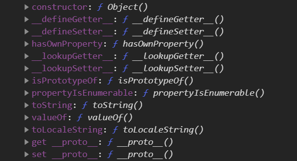

We saw how the `new` keyword works under-the-hood and implemented it from scratch. We'll now see what is `__proto__` property present on objects and how it is different from `prototype`. The concepts are pretty simple so this won't take much time to read and understand.

## What is `proto`?

The `__proto__` property is present on objects. Let's start by creating a object and exploring the `__proto__` property.

```js
const weapon = {
	damage: 45
};

const sword = {
	name: 'Time Dagger'
};

Object.setPrototypeOf(sword, weapon);

console.log(sword.name); // Time Dagger
console.log(sword.damage); // 45
```

This is all known code to us as we saw prototyping last time. If the `sword` doesn't find `damage` property, it will look at the `weapon` object. But, how does it know where to look to. Yes we've used the `setPrototypeOf` function to indicate it but there's a property that helps it to lookup to it. That property is `__proto__`.

```js{14}
const weapon = {
	damage: 45
};

const sword = {
	name: 'Time Dagger'
};

Object.setPrototypeOf(sword, weapon);

console.log(sword.name); // Time Dagger
console.log(sword.damage); // 45

console.log(sword.__proto__); // { damage: 45 }
```

The `__proto__` property is a reference to the prototype that has been set for the object. Point to note is that it is a reference, meaning if we change the original object, the change will also be reflected here.

```js{14,16}
const weapon = {
	damage: 45
};

const sword = {
	name: 'Time Dagger'
};

Object.setPrototypeOf(sword, weapon);

console.log(sword.name); // Time Dagger
console.log(sword.damage); // 45

weapon.level = 3;

console.log(sword.__proto__); // { damage: 45, level: 3 }
```

## What is `prototype`?

There's also thing called `prototype`. What does this do? The `prototype` property only exists on functions and is set as a property if `new` keyword is used. Let's see an example.

```js{7-8}
function Weapon() {}

Weapon.prototype.damage = 45;

const sword = new Weapon();

console.log(Weapon.prototype); // Weapon { damage: 45 }
console.log(sword.damage); // 45
```

In the last post, we saw what the `new` keyword does. Creates an empty object, set the prototype of the object to the constructor's prototype, execute the constructor and return the newly created object. In the example, we added `damage` property to the prototype of `Weapon` function. As `prototype` is an object, the `sword` object can now access the `damage` property. As said earlier, `prototype` is only available on functions just in case if you want to use them as constructors with `new` keyword.

This means that `sword` won't have the `prototype` property as it is a object but it will have a `__proto__` property.

```js{1-2}
console.log(sword.prototype); // undefined
console.log(sword.__proto__); // Weapon { damage: 45 }
```

There's one thing you'll see in the `__proto__` property of an object. A list of functions as shown below.


This is the global object prototype where all objects delegate to.

```js{3}
const emptyObj = {};

console.log(emptyObj.__proto__ === Object.prototype); // true
```

If you add any property to the `prototype` of the global `Object`, it will be available to the `emptyObj` as well and for all other objects.

## Summary

-   The `__proto__` property on objects points out the prototype that has been set for that object.
-   The `prototype` property is only available for functions.
-   The `prototype` property is set as a property if `new` keyword is used to create an object.

_Note: This series is heavily inspired by [Fun Fun Function's series on Object creation](https://www.youtube.com/playlist?list=PL0zVEGEvSaeHBZFy6Q8731rcwk0Gtuxub). The series may give you more insights as it has live coding examples._
